# Volunteer Village

## Introduction

The volunteer village site was designed to be used by people in two roles. 

The first role is as a volunteer looking to provide voluntary assistance. The second is as a coordinator at Volunteer Village who's attempting to match people who are in need of assistance with appropriate assistance. The volunteer signs up and provides contact information and details of what kind of assistance they are able to provide and when they are free on a weekly basis in a profile form which is saved. 

The second role of coordinator can search the volunteers profiles to be given a list of people who can provide that type of assistance at that time to match them with requests external to the system. 

## UX design

The aim is to have a landing page that is enthusiastic about volunteering. This should hook the volunteer without making it seem like hard work. From there a new user (coordinator or volunteer) can sign up, select their role and fill out a profile form.

On every page there is the logo for volunteer village which is based around a helping hand coming out of the dark surrounded by holding hands circle motif and has the words volunteer village in the centre. This is mirrored in the favicon on the tab. Also on every page there is a box (surrounded by shadow - to emphasis it isn't part of the nav) which lets users know if they are logged in and what user name they are logged in as incase they have different logins for different roles. The nav is permanently there to take you to the homepage and relevant pages to the area of the site you are on and who you are logged in as.

As a volunteer they can then see their profile, edit it and delete their personal details from the account, having created it at the beginning of the process.

As a coordinator you can activate accounts of other coordinators, modify and delete other coordinators / your own account. It is anticipated that this would be a small voluntary organisation so no HR/IT department to modify other coordinators - but joining or leaving or name changes would need to be operational by coordinators of each other. This allows for security to be put in place so anyone can't just log in as a coordinator.

Next a coordinator will need to be able to search the list of volunteers by activity and when they are likely to be available, then read their contact details to contact them. So there is a search for volunteers, but this doesn't have any modification/creation/deletion function as their personal data is to stay under control of the volunteers.

Coordinators will also activate the volunteer profiles. This is a manual check which has two purposes, to check it isn't a spam profile and to consider if there is already known opportunities for them to volunteer at.

The layout of the site was improved and made responsive using bootstrap and the background colour was set using CSS. The main use of bootstrap was to move the main part of the page from being stuck to the left / start. Then each item is put in an appropriate place and break points are used to add responsiveness.

Bootstrap was mainly used for moving items to appropriate places using the grid, but also for putting into place some colour coding to make things throughout the site consistent. Functions such as the .nav and .table allowed these to be set up very simply. 

Using bootstrap meant that I could use the built in colours for bootstrap which are functional and familiar context to users.

The required functionality and beginning of the nice to have functionality was put into Epics/User stories/Tasks as shown below.

### Wireframes

The initial [wireframes](document/initial-wireframes.pdf) that were built were for an index page to draw in the volunteer, for a volunteer profile page that can be created and updated by people wishing to volunteer, a page explaining how to use the system and a coordinators page. Some of these had both large monitor and small device setups displayed. Wireframes were not created for the nice to have pages at this stage such as the charities section and feedback and likes section. 

As the coding progressed some of the wireframes had to be deviated from as some of the nice to have ideas were incorporated and some of the fields that were initially designed in became redundant. Index page followed the wireframe idea, the create volunteer profile page only had one major change to the layout and that was rather than toggles for the activities it was decided that a select list would be more pleasing on the page as there are so many radio buttons for the days and times. The coordinator page was completely redesigned as additional functionality than just the search has been coded. Therefore the coordinator page now shows how many people need activating and links to perform tasks. The volunteer search page was also not styled as the coordinator page was going to be as it was decided that the picture/avatar of the volunteer didn't add any value due to it only being seen by the person it was of and coordinators who were unlikely to ever meet the volunteers. Therefore the search just provides written results.

None of the nice to haves were wireframed as although being aware of them during coding was advantageous to not leave problems for future additions what they would look like is not relevant in initial design.

### Relationship diagram

The different apps and relationships were discussed and as the idea formed a rough initial relationship diagram was developed.

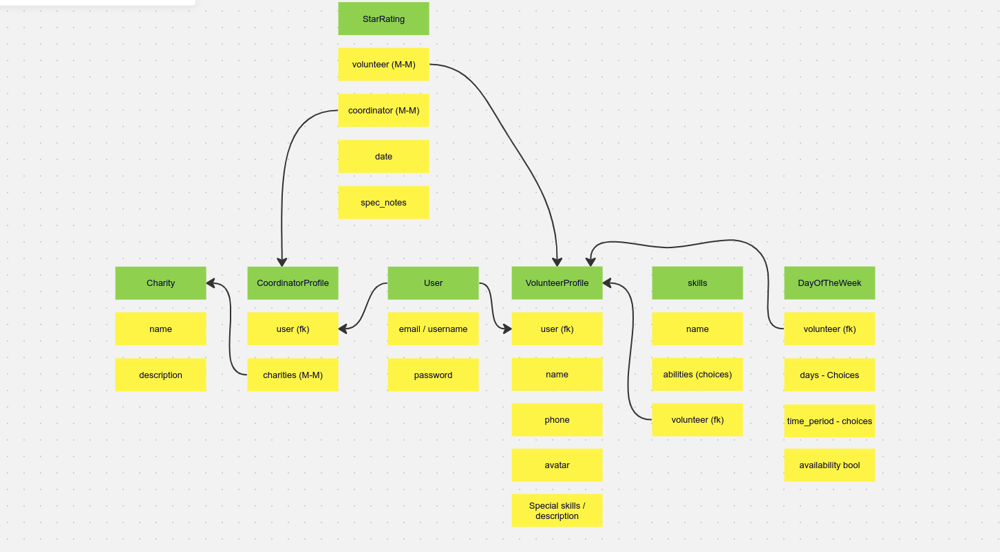

As can be seen from the relationship diagram sketch the additional Charity section and Star Rating section were considered to avoid future problems should they be added at a later stage. The main bulk of the project centered around getting volunteers to sign up with details and coordinators to search them. Therefore we started with a user, this was intended to be through allauth and would sign up everyone that used the site (except admin/userusers). The user then had a one to one relationship with a profile (whether a coordinator profile or a volunteer profile). It was anticipated to store very little information on the coordinators. The volunteers the initial idea was to split into three sections to keep it modular. One for personal details, one for the skills they were offering and one for timeperiods that they were regularly available. This was ultimately combined as the wireframe had the information all being collected on one page which then has some trouble saving. Three forms on one HTML page just added to the complexity of debugging the view and forms. Multiple models also added complexity to searching the information through three models, so one model containing the personal details/skills/time was created from merging the others.

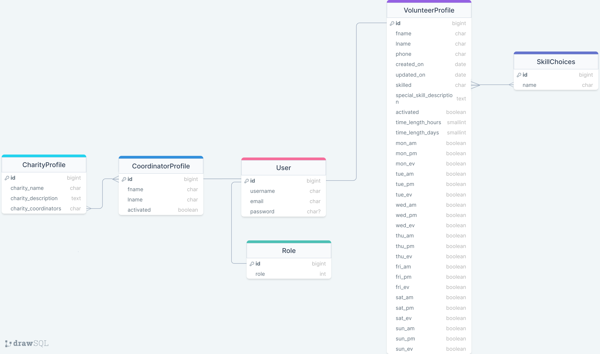

## Epics / User Stories / Tasks

Each issue that was raised for the git projects boards contained acceptance criteria and steps to be taken to complete the issue. In the title they were described as Epics, user stories, or tasks depending on the depth of the requirement.

These were put into milestones and labelled as iterations each one being closed on a Monday with planning of what user stories and tasks would be prioritised that week and the backlog being considered of unfinished work from previous iterations. Prioritisation was done using labels (which were also used to define bugs). This can be seen on [projects](https://github.com/users/RachWalm/projects/3).  

### Epics

The Epics were put together about a week into the project when the scope became apparent as to how much could be achieved and all apart from the last of the epics below were implemented. Until that point userstories were put in place for the work that was immediately apparent.

|Issue| Title |
|--------|-------|
|[[#66](https://github.com/RachWalm/VolunteerVillage/issues/66)](Epic : new to the site )|As a potential volunteer , I can see the site aims and navigate to how it works page so that I can decide whether to use it. |
|[[#61](https://github.com/RachWalm/VolunteerVillage/issues/61)](epic:Volunteer joins site)|As a volunteer, I can join the site and put in my profile so that I can be ready to volunteer.  |
|[[#65](https://github.com/RachWalm/VolunteerVillage/issues/65)](Epic: Volunteers can only see/update/delete their own information and only when logged in )|As a volunteer, I can join the site and put in my profile so that I can be ready to volunteer.  |
|[[#63](https://github.com/RachWalm/VolunteerVillage/issues/63)](Epic: Volunteer reads their profile)|As a Volunteer, I can look at the preferences I have chosen so that I can be confident they are correct.|
|[[#62](https://github.com/RachWalm/VolunteerVillage/issues/62)](Epic: Volunteer update their profile)|As a volunteer, I can update my profile so that I can make any changes as time goes by.  |
|[[#64](https://github.com/RachWalm/VolunteerVillage/issues/64)](Epic : user can delete profile )|As a Volunteer, I can delete my profile so that I can stop using the site and stop them having access to my details.  |
|[[#67](https://github.com/RachWalm/VolunteerVillage/issues/67)](Epic : Coordinators can be registered and log in and out)|As a Coordinator, I can register and log in and out so that I can do my job.  |
|[[#69](https://github.com/RachWalm/VolunteerVillage/issues/69)](Epic: coordinators can be approved)|As a approver, I can get coordinators onto the system so that I can get them coordinating.  |
|[[#68](https://github.com/RachWalm/VolunteerVillage/issues/68)](Epic : coordinator can search the profiles to find someone to do the volunteering)|As a coordinator, I can search for a suitable volunteer so that I can match the activity to a volunteer.  |
|[[#104](https://github.com/RachWalm/VolunteerVillage/issues/104)](Epic: Coordinators can activate the volunteers profile)|As a Coordinator, I can look at new profiles and consider them for old projects and then activate them so that I can check for spam and see what is newly available.  |
|[[#85](https://github.com/RachWalm/VolunteerVillage/issues/85)](Epic: if user isn't logged in but URL for a logged in page typed send to error page)|As a site user, I can **type the url but not be logged in ** so that I can see a useful information error page rather than url not found etc..  |
|[[#70](https://github.com/RachWalm/VolunteerVillage/issues/70)](Epic: charities section of website set up)|As a coordinator, I can create update and delete and read info on charities so that I can use this as a source of information.  |
|[[#71](https://github.com/RachWalm/VolunteerVillage/issues/71)](Epic: ratings and notes area of website created)|As a coordinator, I can make notes and rating the volunteers so that I can keep details and keep track of how many hours of volunteering they have done.  |

### User stories and tasks

There were many user stories and tasks that were set up to ensure that individual functions and requirements didn't get forgotten which can be accessed by [issues](https://github.com/RachWalm/VolunteerVillage/issues?q=is%3Aissue+is%3Aopen). 

## Features

### Existing Features

Every page that should only be used by coordinators checked that that only authenticated people can us it in the HTML with an if user.is_authenticated and a check by the function in views role_authenticate, which checks if they are of the correct role and if they have been activated by a coordinator. This means that an unactivated coordinator doesn't have access or anyone else who shouldn't.

#### Index page

The index page has the same basic heading and footer that is on every page. 

The heading contains a logo, title and the home page and allauth navigation links. It also contains a message as to whether you are logged in (and who you are logged in as) or if you are not logged in. This area also has flash messages when they are relevant.

The remaining of the page is text and images to draw a new user into the idea of volunteering and what can be done

The footer has information about the developer and project is for Code Institute.

#### Allauth settings

The allauth require that certain settings are put in the project settings.py:

```
ACCOUNT_EMAIL_VERIFICATION = 'none'

LOGIN_REDIRECT_URL = 'login_success'
LOGOUT_REDIRECT_URL = '/'
ACCOUNT_SIGNUP_REDIRECT_URL = '/role/role'
```
This proved to be very useful. 

1. The e-mail is optional, and although displayed in the signup page, can be left blank. This also means that e-mail account verification and forgotten password cannot be used. If they put an e-mail in here it is displayed in their profile, but the display box is left blank if they haven't included it. 
2. Sign up could be directed to the role page so that the first decision to be made after getting an account is which role you want can be implemented.
3. Log out it was logical just to go to the landing page as it is generally set up.
4. The log in redirect was probably the most useful as it allowed me to set up a view that used 'if' conditions to determine where to navigate the user. This meant that different roles when to the two separate apps and within that app they were sent to whatever stage of the process that they had completed, depending on filling out details or activation. It took the logged in users information and directed them in role/views.py

```
put function here
```

#### Sign up page

This page is built by allauth, but also has the header and footer as previously described. This was achieved by copying the templates from allauth and extending the custom base.html.

Email verification is set to none in the settings so this field is optional.

#### Log in page

This page is built by allauth, but also has the header and footer as previously described. This was achieved by copying the templates from allauth and extending the custom base.html. On this page the 'forgotten password' link was also removed from the standard template used by allauth - as that functionality has not been set up. It was necessary to go to an old version of allauth to have this visible in the HTML for it to be removed. E-mail is left as optional.

#### Log out page

This page is built by allauth, but also has the header and footer as previously described. This was achieved by copying the templates from allauth and extending the custom base.html.

#### Role choice page

This page is part of the sign up process. As users can either be signing up as a volunteer or as a part of the organisation as a coordinator. The dropdown select has volunteer as the default and only visible when you get to the page as this should be the main option chosen. It can then be changed to coordinator by coordinators.

This page currently only has the option of volunteer or coordinator, this could be simply updated as each role is associated with a number to allow for additional roles, such as charity login or different types of coordinator should the organisation grow to require that coordinators are more focused or want the activations restricted to certain personnel. 

Currently, it is saved where 1 is volunteer and 2 is coordinator. Where it is required that access is blocked 0 has been returned as in the function role_authenticate which is used to restrict pages bringing up their content unless it is a coordinator who is activated.

#### Coordinator add profile page

As the information on this page will be visible to all the coordinators it doesn't contain excessive personal information, it just requests first and last name. This should be sufficient for information in connection to the coordinators - so people know who to contact when getting the coordinator details. This information is placed into the CoordinatorProfile model.

These fields are saved in the CoordinatorProfile and attached to the User via a one to one field.

#### Pending activation page

As the coordinators will have access to almost all functions and large quantities of data, there is then a step where another coordinator needs to activate the coordinator. This will prevent accidental or malicious access as a coordinator. This Pending page is the page that the coordinator is directed to between them signing up and being activated - even if they log out and back in unless they are activated they will go to the Pending page. If they inform another coordinator that they need activating other coordinators can perform this (see below).

#### Volunteer add profile page

If the role of volunteer has been picked then this takes you to the volunteer add profile page. There is little action that a volunteer would want to take without a profile so this is the first place directed to. This page requests information such as name, phone number to contact to volunteer with volunteering opportunities. It also establishes which of the activities from the list they would like to do and when they are regularly available. There is a free text box to add any special skills etc that they want to have highlighted. 

The list of activities that they can pick from is taken from the database in which holds a list of activities and they can select several by holding down control (which is stated in the help text on the page).

The sessions that they are able to attend are boolean fields so that they can be easily switched on and off. I had imagined that they would be laid out in a grid that would account for days being on a row with the times throughout the day being in columns, but with the form display being the most efficient option, this idea was discarded.

The information on form for the phone number is Javascript validated to ensure that the phone field is likely to be a phone number - by make it have to conform to being numerical and 11 digits which is what UK phone numbers are (excluding +44). 

The number of hours and days is restricted to the number of hours and days in a week through Javascript validation.

This is saved in the VolunteerProfile and is connected to the User via a one to one field.

#### Volunteer read their profile page

The volunteer is sent to their profile read page when they have added their profile, or log in with a profile in place. Here they can see the information that is held on them. There is also the option to edit the profile - which sends them to a page to perform that (described below), or delete their profile (which is described below).

This isn't editable on this page to avoid accidental clicking and making corrections.

Most of the data is taken from the VolunteerProfile model (except the e-mail which is taken from the User allauth model).

There are a couple of functions involved in producing this page as there are several items that have multiple either inputs or outputs. Therefore iterating through lists both in the html to display them on the page and searching through a list of model fields to check if the one required is 'true' while not getting activated as 'true'.

If there hasn't been a profile set up for the person or you are not logged in then this page will got to a 404 error, and won't display any erroneous information. This protects information being viewed by anyone but the volunteer through this page.

#### Volunteer edit their profile page

If a volunteer clicks to edit their profile then they are directed to a page that is similar to the form to add their original profile but is populated with the currently held information. To edit they must make the relevant changes to the form and then press submit. Unless submit is pressed no changes will be performed.

This currently does not have the ability to change the e-mail as that is taken from allauth and this form is based on the VolunteerProfile model.

#### Volunteer can delete the profile information

If a volunteer no longer wants their information to be held then they can choose to delete the information. In the read volunteer profile page there is a delete button, this leads only to their details on the database so they can't delete others details. The delete button doesn't instantly delete it goes to a Javascript coded modal which informs them that the delete cannot be undone and then has the delete button or a cancel button. This prevents unintentional deletion by an accidental button click.

It does allow the user to remove their information but retain their sign in. Once they have confirmed the delete it takes them back to be able to fill out a blank profile as there is little that they can use the site for without a profile.

#### Delete modals

The code for the delete modals were taken from the extra tutorial which carried on from the code institute blog tutorial that was posted on slack. 

```HTML
<div class="modal fade" id="deleteModal" tabindex="-1" aria-labelledby="deleteModalLabel" aria-hidden="true">
    <div class="modal-dialog">
        <div class="modal-content">
            <div class="modal-header">
                <h5 class="modal-title" id="deleteModalLabel">Delete comment?</h5>
                <button type="button" class="btn-close" data-bs-dismiss="modal" aria-label="Close"></button>
            </div>
            <div class="modal-body">
                Are you sure you want to delete your comment? This action cannot be undone.
            </div>
            <div class="modal-footer">
                <button type="button" class="btn btn-secondary" data-bs-dismiss="modal">Close</button>
                <a id="deleteConfirm" href="#" class="btn btn-danger">Delete</a>
            </div>
        </div>
    </div>
</div>
```

This code was taken out of the tutorial and adjusted to the three delete modals (volunteer profile, coordinator profile and charity). As the delete button pointed to the modal not directly to a delete, Javascript was then used with an event listener on the modal delete button which then pointed to the url. Which for the volunteers was related to who was logged in and for the coordinators and charities it requires an id to be put in the url relating to which item to delete. The views also has defensive code so it has to be an activated coordinator deleting the coordinator or charity (not required for volunteer as you have to be logged in for it to know which data to delete) - see defensive programming below. 

#### Coordinator dashboard page

This is where active coordinators get sent when they log in (and are activated) and is the centre for all the links that they will need to perform the daily requirements.

It also tells them the state of the activation. The number of activations of both the volunteers and the coordinators that need actioning is displayed on the screen. The names of the coordinators are also put on the screen so that as they will have to search coordinators to activate them they can use this to get the correct spelling. There should only be a few at a time so this list doesn't take much space or if there are a large number of spam profiles they can determine who is legitimate without waiting for a superuser to deal with the spam profiles.

The volunteer activation page provides a list of all volunteers that need activating so there is no list of the volunteers on this page and it is expected that this would hopefully be a much larger list. If there are no volunteers that need activating then the count of volunteers will read 0 and the button to go to the volunteer activation page will not be displayed. Not displaying that button avoids going to a search page that is empty and could cause confusion to users.

From this page they can perform the following activities by following links to :

- Search coordinators to perform tasks on their profiles - this page list coordinators that match the search and allows activation, deactivation, update, see profile and delete profile.
- Add a new charity - this allows the name, who the coordinator/s assigned to the charity are and details in a text box
- Search for existing charity - search for a charity and those that match the search can be updated/viewed/deleted.
- Activate volunteers - This provides a list of volunteers who need activating's names, the button then takes you to all that persons details to be checked. If activated they are removed from the list.
- Search volunteers to match with needs - This is an extremely important function as when a requirement for a task comes in then the coordinators can search for people who do that task and are likely to be available, a list of those people and their details is then provided for the coordinator to phone the person and make arrangements.

#### Forms on pages

All forms undergo csrf tokens to avoid any fraudulent behaviour. 

Forms that can be taken directly from the models as they will save to the models are created using forms.py and put in the HTML as that form.

Searches use inputs that are created individually in the HTML and are not saved in the database.

#### Search pages

All search pages are created with individual inputs in the HTML and the lists for the options are created from data that is saved in the database. 

Some search fields are select inputs. Activities are taken from the SkillChoices Model and time and day are done using the fields in the VolunteerProfile model. Where required they are changed into the verbose name so that users can understand them rather than the shortened versions to allow easier coding.

There are also some free text boxes that then look for the combination of letters that has been used. icontain should be able to deal with capitals vs small letters, but there is a message with these free text boxes reminding users to use capitals appropriately, just in case.

#### Coordinator activate/edit coordinator profiles page

If a coordinator signs up to the site there needs to be a restriction on their access as they will have functionality and data access that shouldn't be freely available, so another coordinator has to activate them by ticking the box and submitting. This page can also be used if the coordinator wishes to change their name - marriage, legally changed name etc. As it isn't anticipated that an organisation like this would have an HR sort of role name changes will have to be done by the coordinators. Also should a coordinator leave temporarily such as materinity leave, then the account will need to be deactivated to restrict access to the information. 

As there is a many to many relationship from charities the coordinator also is removed from displaying against that charity.

Although the functionality to delete coordinators is currently in place, this may need to be deactivated were the commenting on the volunteers activities to be implemented. As if that were implemented and coordinators were making the comments and being recorded as making the comments then deleting the coordinator could be problematic. This functionality is here currently as it has no impact on other functionality and might be useful. Were it necessary to remove this functionality to allow other things that require legacy data to function properly then then activate function could be used to deactivate coordinator restricting their access but not their history.

In the event there are no coordinators activated this could be performed for one coordinator by the superuser in the admin section. 

#### Coordinator search for volunteers page

When a request has been made to the organisation for a type of activity to be performed during a certain part of the week a coordinator can go to the search page and select the activity and the day and whether it is for morning/afternoon/evening and if any of the volunteers fit this description then their name is displayed as a list. The information about the volunteers is then displayed in a non-editable table on screen. Coordinators could then contact the volunteers and organise the activity that is required. 

Whether a volunteer is activated or not they will appear in this search, should the function later be required to only have activated volunteers then this could be easily added as a filter.

#### Coordinator activate volunteers page

Coordinators are required the activate the volunteers for two reasons. To look at incoming volunteers and see if there are any unfullfilled volunteering opportunities that would suit them. Getting people as they join the site will increase enthusiasm for the process, also to ensure that the database doesn't get filled up with spam profiles. Reading the information provided in the text box by volunteers may also be more useful that just having their choice of activity if they have a special skill that can be matched.

#### Coordinator add charity page

Should a new charity wish to be involved then the coordinator can click on the link in the dashboard and add the charity name and a few details in the text box about the charity's needs and information. The charity can also be assigned a coordinator (or two with a back up, or many for a big charity). Then the information is there as to who to get to deal with a charity's request, or if they are away hopefully enough information is in the text box for someone else to assist.

#### Coordinator choose charity page

Once a charity is in the database then coordinators will want access to the information to read/edit/delete. This page allows coordinators to search by the name (partial or full) of the charity and returns a list of the charities that fit the searched text. For each charity there is a look at charity information (which is non-editable to avoid accidental update), an edit and delete button if they need to change the information or if the charity decides to no longer continue the connection.

#### Coordinator view charity page

When the Look at charity information button is pressed a read only version of the information is presented.

#### Coordinator edit charity page

On the choose charity page there is the option to edit the charity. This takes you to a form that is the same format as the add charity form, except it is populated with the currently held information, which can be altered. No changes will take effect until the submit button is pressed.

#### Coordinator delete charity 

In the choose charity page there is a delete button, this leads only to the details of the selected charity so they can't delete others details. The delete button doesn't instantly delete it goes to a Javascript coded modal which informs them that the delete cannot be undone and then has the delete button or a cancel button. This prevents unintentional deletion by an accidental button click.

Deleting a charity does not delete any of the coordinators that are stated in the many to many relationship as this is not a ON_CASCADE relationship.

#### Defensive programming

The pages where there is sensitive information displayed/updated to/by the coordinator have built into the HTML that the user must be is_authenticated and have a role of 2 which is the integer assigned to coordinators. The pages that display sensitive information to the volunteers use the logged in users information to provide them with just their own information so they can't look at or interact with any other information. This secures the visualisation of the pages. In both these instances you don't get to the page you get sent to the 404 error so you can't manipulate the pages in anyway.

All delete functionality is subject to a modal so that they can choose to halt the delete if it has been clicked in error by cancelling or clicking out of the modal.

The delete function for the volunteers deleting their own information is once again defended by using the logged in person as the information that is deleted.

The other delete functions have the role_authenticate function in the views.py for that action to ensure that they are logged in as a coordinator to be able to delete. If they are not a coordinator then they are redirected to the index page without the delete going ahead. As the setting up the role can be accessed just through sign up I have not put in defensive programming here and if attempting to set a role without being logged in it will have an error. If you attempt to add a volunteer profile without being logged in when you press submit it leads to an error.

#### Navigation bars
The top right navigation bar is for login/signup/logout functionality related to allauth and not specific to the type of user logged in. Or to go to the home page.

#### Logged in/out at top of page

In the top right of the screen next to the nav bar there is an information message that either tells you that you are "Not logged in"  or who you are logged in as (people may have a coordinator and volunteer account).

#### Flash messages

Most activities that involve change contain a flash message. If the user performs an allauth related activity (login/logout etc.) or if the user updates the database in some way a flash message should appear on the screen for 2.5 seconds. Other activities such as searches are apparent by the messages on the screen or results being displayed.

#### Superuser/admin activities

Most activities can be performed by the users in one role or another.

One activity that is superuser exclusively able to do is the option for the super user to change the list of activities that can be selected and searched for. This action only needs to be performed once and both selection and search will be updated. 

Database updates/creations/deletions/activations for everything can also be performed in the admin section of the site.

Delete/reset spam profiles is a function that can only be performed by within the admin area. 

If someone has signed up as a coordinator by mistake that shouldn't have (accidentally meant to be a volunteer) or maliciously then the superuser can also remove their username from roles and coordinator profiles and then they can resubmit their details as a volunteer - or not if they didn't want to be a volunteer.

If there are no coordinators activated (so no one can activate other coordinators) a coordinator can also be activated in the admin panel in the coordinators profile, then the usual procedure for activating coordinators can proceed.

### Potential Future Feature Developments 


There were some ideas that would make the site more useful but are outside prime objective of the site to allow volunteers to sign up and then be matched with requests. These were still initially thought through to avoid coding in such a way as to require an extensive recode to introduce them later.

In an ideal extension the coordinators will also have their own charities that they work with, there is a section for them to record information in a text box about their charities. This text box section is to record information on their charities for their own memory and if it needs to be cross-referenced/used by other coordinators should the primary coordinator be away or a deputy be working with them. There is a link showing which coordinators and charities work together.

It would also be great if feed back or notes on the volunteers could be made by the coordinators. Maybe allowing them to have a star system to show how many activities they have undertaken maybe reaching certain levels gives you a different badge or title. Also where praise has been given by the people they assist that this could be fed back to the volunteers through their page.

I expect that a similar function where notes on a volunteer from one coordinator to other coordinators could be left that isn't seen by the volunteer. Such as when they have contacted someone about something but it wasn't a match so that a different coordinator doesn't attempt the same match.
comments and likes area

An area to save activity requests from public and charities that haven't been full-filled. Would give an open activities area which could be searched.

And historic information

Improve the model for the days and times as it would be much better if I had managed to use the initial idea of monday = 1 Tuesday = 2 etc and am = 1 pm =2 so then monday am would be 11, this would have given a simpler and lesser number of fields. However, with problems (described in bugs) doing the initial volunteer create profile and time constraints it was decided to go simple for booleans. This would also have made searching for the volunteers that fitted the criteria required simpler. If I had infinite access to more knowledgeable developers I would have discussed this approach with them as I believe it would have saved time in other areas such as the coordinators search of the volunteers.

Once information has been gathered from the text box entries of the coordinators and volunteers entries there, an assessment of the data to look for recurring themes that could be made into fields rather than them typing it out would be a good step.

Real time or calendar inputs for emergency or one of events

coordinator can change volunteers availability when weekly stuff occurs to already volunteering. and record volunteering being done.

follow up tools for coordinators

volunteers can search the charities with the permission of the charity.

Email is an option on sign up but should be possible to update and include or change it later.

There could be a section to request assistance. This would mean that where charities or individuals needed to contact the organisation out of hours they could leave a message.

Relate amount of time available to committed already time. It would be useful to be able to know if someone already performs activities at a certain time so although their sessions could reflect that they are open at that time to do volunteer work, that they already have a commitment through the system would allow coordinator not to attempt to double book and volunteers to see how productive they are being.

It may be required for some sort of audit to know everyone involved so searches for all volunteers or coordinators can use the code that is already in place. This would mean the search functions don't filter anyone out.

## Bugs

limited time after save problem

boot

index no css colour

### Unsolved bugs

At the very end of the project I realised that the boostrap parameters should go in the div tags. Through out I had been putting them on the objects in the HTML. This is a widespread bug throughout the project and would take significant time to rectify. As this was only discovered during the testing and documenting phase there was insufficient time to go through the code to ensure better practise was observed.

## Technologies

### Languages used

- [HTML](https://developer.mozilla.org/en-US/docs/Web/HTML) was used for the coding of the site.
- [CSS](https://developer.mozilla.org/en-US/docs/Web/css) was included for styles and layout of the site.
- [python 3.11.5](https://docs.python.org/3/) for functionality.
- [JS](https://developer.mozilla.org/en-US/docs/Web/javascript) to incorporate the modal and validate the time and phone number.
### Frameworks and libaries
- [Django](https://www.djangoproject.com/) Framework based on python.
- [Boostrap](https://getbootstrap.com/docs/5.0/getting-started/introduction/)


### Databases

- [SQLite](https://www.sqlite.org/index.html) development database.
- [PostgreSQL](https://www.postgresql.org/) deployed database.


### Tools

- [VSCode](https://code.visualstudio.com/) was used to create and edit the website.
- [Git](https://git-scm.com/) was used for the version control and project board to plan the project.
- [Heroku](https://www.heroku.com/) was used to deploy and host site.
- [Pip3](https://pypi.org/project/pip/) was used for installing.
- [gunicorn](https://gunicorn.org/) as a Python WSGI HTTP Server.
- [dj_database_url](https://pypi.org/project/dj-database-url/) to work with Django.
- [pyscopg2](https://peps.python.org/pep-0249/) for python database access.
- [Django-allauth](https://docs.allauth.org/en/latest/) for authentication and signup/in/out pages.
- [Elephantsql](https://www.elephantsql.com/) to host the postgreSQL database for deployment.
- [DrawSQL](https://drawsql.app/) for relationship diagram drawing.

### Web resources

- [Chrome-DevTools](https://developer.chrome.com/docs/devtools/) were extremely useful for trying out different code without affecting my core code and particularly when working on responsiveness.
- [Lighthouse](https://developer.chrome.com/docs/lighthouse/overview/) was used to check for performance and accessibility.
- [HTML-markdown-validator](https://validator.w3.org/) was used to validate the HTML.
- [CSS-validator](https://jigsaw.w3.org/css-validator/) was used to perform the CSS validation.
- [PEP8Online.com](https://pep8ci.herokuapp.com/) was used to validate python coding
- [Jshint](https://jshint.com/) was used to validate the JS.
- [favicon](https://favicon.io/favicon-converter/) to generate my favicon from my logo.
- [Responsive viewer extension](https://chrome.google.com/webstore/detail/responsive-viewer/inmopeiepgfljkpkidclfgbgbmfcennb) to produce the responsive view for my testing.

### Images

<a href="https://www.freepik.com/free-photo/man-cutting-grass-with-lawn-mover-back-yard_8828103.htm#query=mowing%20lawn&position=0&from_view=search&track=ais&uuid=1f1d6d2e-ade9-4baf-b4d2-4fda06f92667#position=0&query=mowing%20lawn">Image by senivpetro</a> on Freepik

### Libraries

allauth

go through requirements.txt

https://stackoverflow.com/questions/20138049/redirect-user-to-another-url-with-django-allauth-log-in-signal

Django documentation

## Deployment

### Heroku deployment

The deployed version can be accessed on Heroku [here](https://volunteervillage-8a4d89acc796.herokuapp.com/)

Before deployment you will need to collect all the requirments into requirements.txt

```
pip3 freeze --local > requirements.txt
```
and create a Procfile (with a capital P) containing:

```
web: gunicorn volunteervillage.wsgi:application
```

Ensure that the version that you want to deploy has been added, committed and pushed to GitHub (as Heroku will take it from the repository).

1. [Heroku](https://www.heroku.com/) was used to deploy.
2. Once logged onto the website, using the drop down menu in the top right we went to the dashboard.
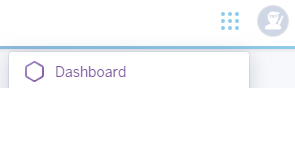
3. From here we are able to create a new app either by clicking on the icon (which is what we did)

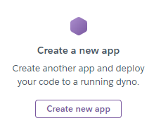

or the drop down menu


4. Next the app was named volunteervillage and the Europe region chosen in these fields


and the purple 'create' button was pressed.

5. In the menu navigation bar the 'settings' was selected


6. The section with Config Vars was then opened up by clicking the Reveal Config Vars button

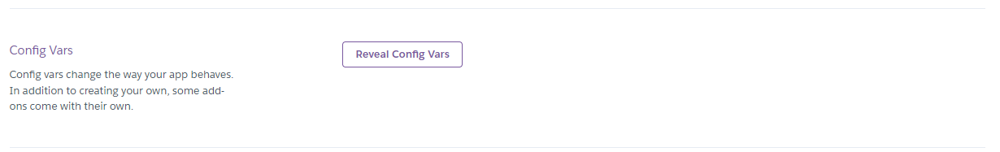

7. The URL's were set, disable_collectstatic was set to 1, port was set to 8000 and the secret key was provided the value. Cloudinary_URL and the Disable_collectstatic were later removed. The database_url was copied from the elephantSQL.

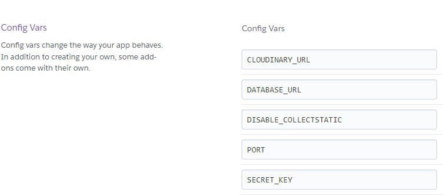

8. Now we used the menu navigation bar again, this time to select deploy

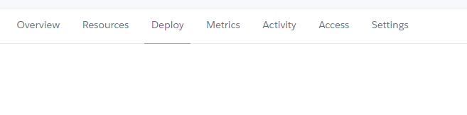

9. The deployment method was selected by clicking on the GitHub icon and it stated that it was connected to github


10. The repository was chosen by searching my github


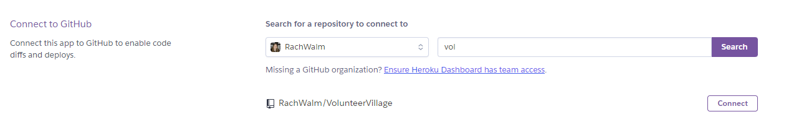
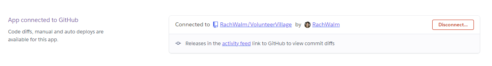

11. Automatic deployment was chosen so that it would update every time the changes were pushed to git


12. It was deployed

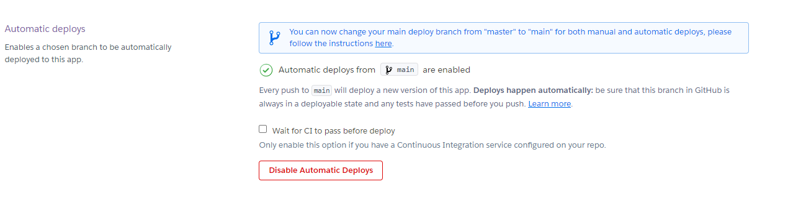

When it is in the final version it needs to have debug (in settings.py) set to False (was True during development) and as mentioned above the DISABLE_COLLECTSTATIC removed from the config vars.

### Local Deployment

You will need to pip install the following apps:

Django and gunicorn

```pip3 install django gunicorn```

dj database url and psycopg2

```pip3 install dj_database_url psycopg2```

bootstrap

```pip3 install django-bootstrap5```

whitenoise

```pip3 install whitenoise```

allauth

```pip3 install django-allauth```

Or if you wish to install them all at once you can use the requirements.txt file (I couldn't as the requirements.txt is made from what is installed).
In the IDE terminal:
 ```
 pip3 install -r requirements.txt
 ```

### Cloning

1. In the git hub repository, code button clicked
2. clicked local
3. choose HTTPS
4. link copied
5. went to terminal of the IDE and input the following :git clone https://github.com/RachWalm/VolunteerVillage.git

The project was cloned.

For it to work you will need to install the list in local deployment and also set up an env.py and reference it in the settings.

The env.py needs to contain:

```
import os

os.environ["DATABASE_URL"]="link gained from elephantSQL for the database see below"
os.environ["SECRET_KEY"]="Enter your secret key here" 
```

A .gitignore file must be used and the env.py should be added to it so that the information in there that should be kept private such as the secret key is not put on GitHub.

To run the local deployment in the IDE terminal window :

```
python3 manage.py runserver
```

### ElephantSQL

1. Sign up to ElephantSQL and login
2. From the dashboard click create new instance:

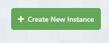

3. Choose and name and plan (tags not needed) and click green select region

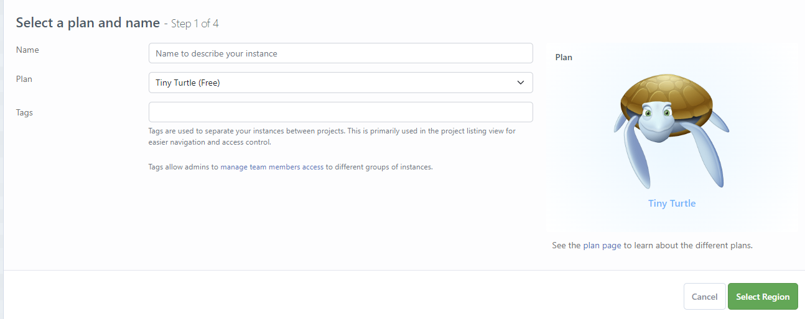

4. Select region and click green review button

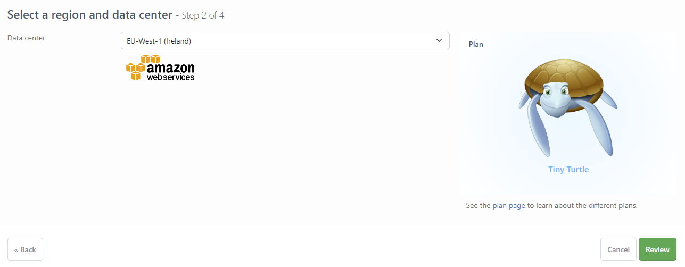

5. Back on the dashboard click on the name of the instance that you created and then you can copy the url (icon of multiple sheets of paper) to be used on heroku and in your env.py as the database_url.

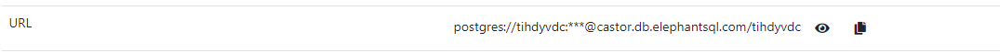

6. It is worth checking that you have a version that is higher than 12.0 as lower versions will not work. On the right hand side menu click on stats:

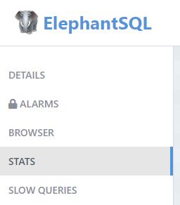
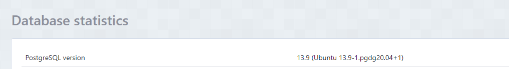

Once you have a database you will need to migrate the models to the database.

This can be done in the IDE terminal windownusing:

``` python3 manage.py makemigrations```
then
``` python3 manage.py migrate```

if you are planning on using the admin area a super user will be required which can be created by:

``` python3 manage.py createsuperuser```

## Testing 

See [Testing](TESTING.MD)

## Credits

### Images

## Acknowledgements

My Mentor - Juliia Konn has been extremely enthusiastic and provided encouragement and a great deal of support.

My family - Pat Walmsley and Sarah Walmsley have tested the site on their own devices and given very useful feedback.

My Partner - Ian Harris who has been extremely supportive while I have been working on this project.

Code institute - For all the information and course content that has contributed to the creation of this project. 

Django blog extra tutorial on slack which gave me many idea and the delete modal code to base my delete modal on.


Women receiving shopping
Image by <a href="https://www.freepik.com/free-photo/people-bringing-supplies-neighbors_19535236.htm#query=companionship%20volunteering&position=17&from_view=search&track=ais&uuid=2f1dea90-1275-4815-984c-bcc37292cb49">Freepik</a>

Drinking tea
No attribution required	
https://pxhere.com/en/photo/180168

driving

Image by <a href="https://www.freepik.com/free-photo/people-helping-old-neighbor_19535511.htm#query=driving%20volunteering&position=1&from_view=search&track=ais&uuid=addf44f7-640b-4aa8-9100-d3ec883618e9">Freepik</a>

Man fixing sink
<a href="https://www.freepik.com/free-photo/man-fixing-kitchen-sink_2893988.htm#page=2&query=DIY&position=26&from_view=search&track=sph&uuid=2ee109c1-c1dc-42e7-b7d4-3f96cf994dce">Image by rawpixel.com</a> on Freepik

Messy desk
https://pxhere.com/en/photo/1294988?utm_content=shareClip&utm_medium=referral&utm_source=pxhere

fundraising
<a href="https://www.freepik.com/free-vector/hand-drawn-minimalist-fundraising-goals-thermometer-vertical-timeline_44590282.htm#query=fundraising&position=23&from_view=search&track=sph&uuid=7136730d-014b-41a6-ad43-7f7a41eb1b75">Image by Wepik</a> on Freepik

Helping at a stall
Image by <a href="https://www.freepik.com/free-photo/people-meeting-community-center_20146042.htm#page=2&query=fundraising&position=1&from_view=search&track=sph&uuid=b3a76a17-f264-4772-8f79-331eaa395a38">Freepik</a>

Litter picking

Image by <a href="https://pixabay.com/users/antranias-50356/?utm_source=link-attribution&utm_medium=referral&utm_campaign=image&utm_content=250044">Manfred Antranias Zimmer</a> from <a href="https://pixabay.com//?utm_source=link-attribution&utm_medium=referral&utm_campaign=image&utm_content=250044">Pixabay</a>

Laughing litter pickers

<a href="https://www.freepik.com/free-photo/man-woman-picking-up-trash-from-park-they-collecting-litter-garbage-bag_6889450.htm#page=3&query=environmental&position=18&from_view=search&track=sph&uuid=e79066ba-0560-4981-89b0-f0660cac7f7d">Image by teksomolika</a> on Freepik

Man covered in litter

<a href="https://www.freepik.com/free-photo/photo-surprised-red-haired-man-has-thick-beard-overloaded-with-much-garbage-collects-plastic_11486288.htm#page=4&query=environmental&position=25&from_view=search&track=sph&uuid=f2a5049c-196e-4901-8b94-7425e235573b">Image by wayhomestudio</a> on Freepik

Tutor
<a href="https://www.freepik.com/free-photo/education-concept-student-studying-brainstorming-campus-concept-close-up-students-discussing-their-subject-books-textbooks-selective-focus_1239167.htm#query=tutoring&position=2&from_view=search&track=sph&uuid=5051e72e-6ca4-4128-a144-0e9e94891ca5">Image by mindandi</a> on Freepik

Adult tutoring
Image by <a href="https://www.freepik.com/free-photo/back-view-teacher-student-home_7871378.htm#query=tutoring&position=9&from_view=search&track=sph&uuid=5051e72e-6ca4-4128-a144-0e9e94891ca5">Freepik</a>

Smiling child tutoring
Image by <a href="https://www.freepik.com/free-photo/close-up-father-helping-kid-with-homework_20081813.htm#query=tutoring&position=26&from_view=search&track=sph&uuid=5051e72e-6ca4-4128-a144-0e9e94891ca5">Freepik</a>

Women reading
Image by <a href="https://pixabay.com/users/nigelcohen-2990028/?utm_source=link-attribution&utm_medium=referral&utm_campaign=image&utm_content=7321085">Nigel Cohen</a> from <a href="https://pixabay.com//?utm_source=link-attribution&utm_medium=referral&utm_campaign=image&utm_content=7321085">Pixabay

event
Image by <a href="https://www.freepik.com/free-photo/group-people-volunteering-foodbank-poor-people_15574024.htm#from_view=detail_serie">Freepik</a>

https://compressnow.com/

canava design the logo

search bar

https://www.youtube.com/watch?v=AGtae4L5BbI

https://favicon.io/favicon-converter/

modal for delete from extra blog post on slack