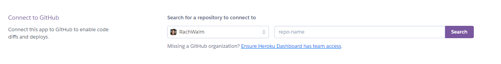

Welcome,

This is the Code Institute student template for Codeanywhere. If you are using Gitpod then you need [this template](https://github.com/Code-Institute-Org/gitpod-full-template) instead.  We have preinstalled all of the tools you need to get started. It's perfectly ok to use this template as the basis for your project submissions.

You can safely delete this README.md file, or change it for your own project. Please do read it at least once, though! It contains some important information about Codeanywhere and the extensions we use. Some of this information has been updated since the video content was created. The last update to this file was: **August 30th, 2023**

## Codeanywhere Reminders

To run a frontend (HTML, CSS, Javascript only) application in Codeanywhere, in the terminal, type:

`python3 -m http.server`

A button should appear to click: _Open Preview_ or _Open Browser_.

To run a frontend (HTML, CSS, Javascript only) application in Codeanywhere with no-cache, you can use this alias for `python3 -m http.server`.

`http_server`

To run a backend Python file, type `python3 app.py`, if your Python file is named `app.py` of course.

A button should appear to click: _Open Preview_ or _Open Browser_.

In Codeanywhere you have superuser security privileges by default. Therefore you do not need to use the `sudo` (superuser do) command in the bash terminal in any of the lessons.

To log into the Heroku toolbelt CLI:

1. Log in to your Heroku account and go to _Account Settings_ in the menu under your avatar.
2. Scroll down to the _API Key_ and click _Reveal_
3. Copy the key
4. In Codeanywhere, from the terminal, run `heroku_config`
5. Paste in your API key when asked

You can now use the `heroku` CLI program - try running `heroku apps` to confirm it works. This API key is unique and private to you so do not share it. If you accidentally make it public then you can create a new one with _Regenerate API Key_.

---

Happy coding!

# Volunteer Village

## UX design

### Wireframes

The [wireframes](document/initial-wireframes.pdf) that were built were for an index page to draw in the volunteer, for a volunteer profile page that can be created and updated by people wishing to volunteer, a page explaining how to use the system and a co-ordinators page. Some of these had both large monitor and small device setups displayed.

### Relationship diagram

The different apps and relationships were discussed and as the idea formed a rough initial relationship diagram was developed.


## Features

## Technologies

### languages used

- [HTML](https://developer.mozilla.org/en-US/docs/Web/HTML) was used for the coding of the site.
- [CSS](https://developer.mozilla.org/en-US/docs/Web/css) was included for styles and layout of the site.
- [python 3.11.5](https://docs.python.org/3/) for functionality.


### tools

- [VSCode](https://code.visualstudio.com/) was used to create and edit the website.
- [Git](https://git-scm.com/) was used for the version control and project board to plan the project.
- [Heroku](https://www.heroku.com/) was used to deploy and host site.
- [pythontutor](https://pythontutor.com/render.html#mode=edit) for working though my code step by step so I could gain understanding when it didn't behave as I anticipated.

### Web Resources

- [Chrome-DevTools](https://developer.chrome.com/docs/devtools/) were extremely useful for trying out different code without affecting my core code and particularly when working on responsiveness.
- [Lighthouse](https://developer.chrome.com/docs/lighthouse/overview/) was used to check for performance and accessibility.
- [HTML-markdown-validator](https://validator.w3.org/) was used to validate the HTML.
- [CSS-validator](https://jigsaw.w3.org/css-validator/) was used to perform the CSS validation.
[PEP8Online.com](https://pep8ci.herokuapp.com/) was used to validate python coding

[AmIResponsive](https://ui.dev/amiresponsive).

[coolors](https://coolors.co/)

[Responsive viewer extension](https://chrome.google.com/webstore/detail/responsive-viewer/inmopeiepgfljkpkidclfgbgbmfcennb) 

### Libraries

https://pypi.org/project/django-select-multiple-field/
https://docs.djangoproject.com/en/4.2/ref/models/fields/#choices
https://django-phonenumber-field.readthedocs.io/en/latest/

## Deployment

### Heroku Deployment

The deployed version can be accessed on Heroku [here](https://black-jack21-fa4b7e8cb0bf.herokuapp.com/)

1. [Heroku](https://www.heroku.com/) was used to deploy.
2. Once logged onto the website, using the drop down menu in the top right we went to the dashboard.

3. From here we are able to create a new app either by clicking on the icon (which is what we did)


or the drop down menu


4. Next the app was named black-jack21 and the Europe region chosen in these fields


and the purple 'create' button was pressed.

5. In the menu navigation bar the 'settings' was selected


6. The section with Config Vars was then opened up by clicking the Reveal Config Vars button


7. The URL's were set, disable_collectstatic was set to 1, port was set to 8000 and the secret key was provided the value.


8. Now we used the menu navigation bar again, this time to select deploy


9. The deployment method was selected by clicking on the GitHub icon and it stated that it was connected to github


10. The repository was chosen by searching my github




11. Automatic deployment was chosen so that it would update every time the changes were pushed to git


12. It was deployed


### Local Deployment

You will need to pip install the following apps:

Django and gunicorn

```pip3 install django gunicorn```

dj database url and psycopg2

```pip3 install dj_database_url psycopg2```

cloudinary

```pip3 install dj3-cloudinary-storage```

Phone number field

```pip install "django-phonenumber-field[phonenumberslite]"```

select multiple from a list

```pip install django-select-multiple-field```


### Cloning

1. In the git hub repository, code button clicked
2. clicked local
3. choose HTTPS
4. link copied
5. went to terminal (version control) and input the following :git clone https://github.com/RachWalm/VolunteerVillage.git

The project was cloned.


### Forking

## Testing 

See [Testing](TESTING.MD)

## Credits


## Acknowledgements

My Mentor - Juliia Konn has been extremely enthusiastic and provided encouragement and a great deal of support.

My family - Pat Walmsley and Sarah Walmsley have tested the site on their own devices and given very useful feedback.

My Partner - Ian Harris who has been extremely supportive while I have been working on this project.

Code institute - For all the information and course content that has contributed to the creation of this project. 