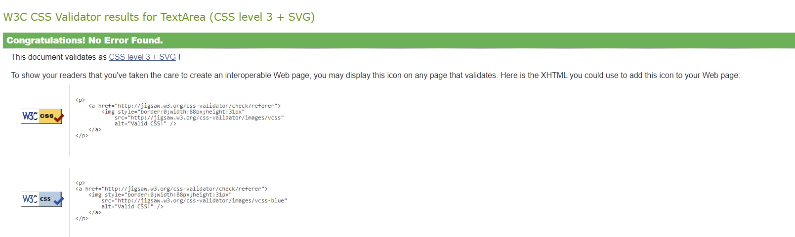

# Testing

## Validators

See README for validator information

### HTML validation

The HTML validation is below in a pdf.

[html validation](document/html.pdf)

### CSS validation

Code was manually copied to the validator.

### Javascript Validation

Code was manually copied to the validator.

[Coordinator add profile validation](document/covalidation.png)
[Volunteer add profile validation](document/volvalidation.png)
[delete charity check](document/deletecharity.png)
[delete coordinator check](document/deletecoordinator.png)
[delete volunteer check](document/deletevolunteer.png)

### Python Validation

Python code copy and pasted into validator and put in the pdf below.

[python validation](document/py.pdf)

## Lighthouse and accessibility

[index](document/lightindex.png) - performance could be improved with pictures resized and reformatted - this would be a future improvement.

### Allauth

[signup](document/lightsignup.png)

[login](document/lightlogin.png)

[logout](document/lightlogout.png)

### Charity

[add_charity](document/lightadd-charity.png)

[choose_charity](document/lightchoose-charity.png)

[read_charity](document/lightread-charity.png)

[update_charity](document/lightupdate-charity.png)

### Coordinator

[activate_volunteer](document/lightactivate-volunteers.png)

[activate_volunteers](document/lightactivate-volunteer.png)

###[add_profile](document/lightcoadd-profile.png)

[choose_profile](document/lightchoose-profile.png)

[dashboard](document/lightdash.png)

[pending](document/lightpending.png)

[search_volunteers](document/lightsearch-volunteer.png)

[see_profile](document/lightsee-profile.png)

[update_profile](document/lightupdate-profile.png)

### Errors

[404](document/404.png)

[500](document/light500.png)

### Role

[role](document/lightrole.png)

### Volunteer

[add_profile](document/lightadd-profile.png)

[edit_profile](document/lightvoledit-profile.png)

[read_profile](document/lightvolread-profile.png)

## Features testing - Manual

Each page is tested for it's functionality for all features including python and JS functions. Features that appear in many pages maybe tested just once and referenced.

#check each page against role to view it and logged in and activated

### Pages

#### Base.html on every page

Unless stated tested on index page, but visual check on every page - will be noted if doesn't work on any page tried.

|Feature|How tested|Result|Comments|
|---|-----|-----|-----|
|Looks correct on load|Page loaded as expected|Yes||
|Logo|Present and sized correctly|Yes||
|Favicon|Present|Yes||
|Appropriate message gap|visible items on each end with central gap|Yes||
|Sign in|Button looks right and leads to sign in when clicked|Yes||
|Sign up|Button looks right and leads to sign up when clicked|Yes||
|Home page link present|tested on many pages to return to home page and looks right|Yes||
|Website name|Name present in correct position|Yes||
|Content|Content inbetween base html|Yes||
|Footer|Correct colour and stuck to bottom with scrolling|Yes||
|Footer|Contains correct content and doesn't cover main page content|Yes||
|Signed in|When signed in sign up/in not present and who is signed in replaces it|Yes||
|Signed in|When signed in Nav on top right adds sign out and your homepage links tested on many pages|Yes||
|Signed in|sign out link works tested on many pages|Yes||
|Signed |Your home page link works tested on many pages|Yes||

#### Index page

|Feature|How tested|Result|Comments|
|---|-----|-----|-----|
|base.html|All base in place|Yes||
|Text and pictures|All in expected positions|Yes||
|Pictures|Aren't distorted on an views|Yes||
|Text|Adjust number of lines to fit view|Yes||
|Responsive|Changes to one column at suitable break point|Yes||
|||||

#### Sign up page

|Feature|How tested|Result|Comments|
|---|-----|-----|-----|
|Page layout|Looks as expected|Yes||
|Form|Required boxes in place|Yes||
|Form|Can't sign up without a user name|Yes|Built in warning|
|Form|Can't sign up without password|Yes|Built in warning|
|Form|Can't leave second password blank|Yes|Built in warning|
|Form|Can't use password that doesn't meet criteria|Yes|Built in warning|
|Form|Can sign up with a e-mail address|Yes||
|Form|Can sign up without an e-mail address|Yes|optional in settings|
|Form|E-mail address must contain @|Yes||
|Form|E-mail address has to have format of email a@b.c|Yes||
|Form|Submit saves user|Yes||
|message|message at top of page for 2.5 seconds when sign up success|Yes||

#### Log in page

|Feature|How tested|Result|Comments|
|---|-----|-----|-----|
|layout|Looks as expected|Yes||
|inputs|Must enter a user name|Yes|Built in warning|
|inputs|Must enter a password|||
|inputs|Not recognised username|Yes|Built in message|
|inputs|Not recognised password|Yes|Built in message|
|inputs|forgotten password link not available|Yes||
|sign in button|if everything is correct signs you in|Yes||
|message|message at top of page for 2.5 seconds when log in|Yes||

#### Log out page

|Feature|How tested|Result|Comments|
|---|-----|-----|-----|
|layout|Looks as expected|Yes||
|Sign out button|works as expected|Yes||
|message|message at top of page for 2.5 seconds when log out success|Yes||

#### Role choice page

|Feature|How tested|Result|Comments|
|---|-----|-----|-----|
|Page layout|Looks as expected|Yes||
|Volunteer|sign up as volunteer select|Yes||
|Coordinator|Sign up as coordinator select|Yes||
|Multiple|Can't sign up as both|Yes||
|Submit volunteer|submitting saves as volunteer|Yes||
|Submit coordinator|submitting saves as coordinator|Yes||
|message|generates update message at top of screen for 2.5 seconds when saved|Yes||

#### Coordinator add profile

|Feature|How tested|Result|Comments|
|---|-----|-----|-----|
|layout|looks as expected|Yes||
|form|Contains required inputs|Yes||
|form|Can't leave first name blank|Yes||
|form|Can't leave second name blank|Yes||
|form|Can't enter anything that isn't an name|No|See bugs|
|Submit|saves the data and moves you to pending page|Yes||
|message|generates update message at top of screen for 2.5 seconds when saved|Yes||

#### Pending activation page

|Feature|How tested|Result|Comments|
|---|-----|-----|-----|
|Layout|Looks as expected|Yes||
|Layout|no button to proceed in unactivated users|Yes||
|Layout|If user activated while still on page they can refresh to see button to proceed|Yes||
|Proceed button|Proceed button works|Yes||
|back button|if logged in an press back button it takes you to page|Yes||
|back button|if logged out no access|No access|Error 500|
|url|will take you there if logged in to correct version vs activated|Yes||
|url|will not work if not logged in|No access|Error 500|

#### Volunteer add profile page

|Feature|How tested|Result|Comments|
|---|-----|-----|-----|
|Page title|Create your profile|Yes||
|Form|Contains expected boxes|Yes||
|Form|Clear which data and labels match|Yes||
|Form|Helper text stands out|Yes||
|Form|Verbose names making it human readable|Yes||
|Form|Layout|As expected|Yes|
|Submit button|Saves new profile data|Yes||
|Page layout|As expected|Yes||
|JS validation|Alert works when first name empty|Yes||
|JS validation|Alert works when last name empty|Yes||
|JS validation|Alert works for letters or number not being 11 digits for the phone number|Yes||
|JS validation|Alert works if no skill is selected|Yes||
|JS validation|Alert work if hours per week negative|Yes||
|Form content|hours per week won't accept letters etc.|Yes||
|Form content|hours per week accepts 0|Yes||
|JS validation|Alert works if hours per week exceeds hours in a week|Yes||
|Form content|Accepts positive number in hours per week (with above exclusions)|Yes||
|JS validation|Alert work is days per week negative|Yes||
|Form content|days per week won't accept letters etc.|Yes||
|Form content|days per week accepts 0|Yes||
|JS validation|Alert works if days per week exceeds hours in a week|Yes||
|Form content|Accepts positive number in days per week (with above exclusions)|Yes||
|Form content|Will allow every timeslot to be accepted and save|Yes||
|Form content|Will allow random selection of timeslots to be accepted and save|Yes||
|Form content|Will allow no timeslots to be selected and save|Yes||
|Form content|Will allow one timeslot to be selected and save|Yes||
|Form content|Will allow text in the skills description box and save|Yes||
|Form content|Will allow no text in the skills description box and save|Yes||
|Form content|Will allow one skill selection to save|Yes||
|Form content|Will allow all skills selected to save|Yes||
|Form content|Will allow random selection of skills to save|Yes||
|Url|Can enter form using url if logged in|Yes|Not if you already have a profile|
|Url|Can't enter form using url if not logged in|No entry|404 error page|
|back button|Can enter and use form via back button if logged in|Yes||
|back button|Can't enter form by back button if not logged in|No entry|Just sends you to a blank page so can't adjust data but still nav links to get back|
|back button|No form if you already havve a profile and press back to add profile so can't confuse data|Yes|Warning and redirect|
|message|generates update message at top of screen for 2.5 seconds when saved|Yes||

#### Volunteer read their profile page
|Feature|How tested|Result|Comments|
|---|-----|-----|-----|
|Nav links|Top left and lead to home page and edit profile respectively|Yes||
|Page title|Your profile and the user name|Yes||
|Table|Contains expected information|Yes||
|Table|Contents checked against admin version of that profile|Yes||
|Table|Clear which data and labels match|Yes||
|Table|Verbose names making it human readable|Yes||
|Table|Layout|As expected||
|Edit profile button|leads to edit profile page|Yes||
|Delete profile|leads to delete confirmation modal|Yes||
|Page layout|As expected|Yes||

#### Volunteer edit their profile page
|Feature|How tested|Result|Comments|
|---|-----|-----|-----|
|Nav links|Top left and lead to home page and stay on edit profile respectively|Yes||
|Page title|Edit profile and warning nothing saved till click submit|Yes||
|Form|Contains expected information|Yes||
|Form|Contents checked against admin version of that profile|Yes||
|Form|Clear which data and labels match|Yes||
|Form|Helper text stands out|Yes||
|Form|Verbose names making it human readable|Yes||
|Form|Layout|As expected|Yes||
|Submit button|Saves new profile data and retains unchanged data|Yes||
|Page layout|As expected|Yes||
|JS validation|Alert works when first name empty|Yes||
|JS validation|Alert works when last name empty|Yes||
|JS validation|Alert works for letters or number not being 11 digits for the phone number|Yes||
|JS validation|Alert works if no skill is selected|Yes||
|JS validation|Alert work if hours per week negative|Yes||
|Form content|hours per week won't accept letters etc.|Yes||
|Form content|hours per week accepts 0|Yes||
|JS validation|Alert works if hours per week exceeds hours in a week|Yes||
|Form content|Accepts positive number in hours per week (with above exclusions)|Yes||
|JS validation|Alert work is days per week negative|Yes||
|Form content|days per week won't accept letters etc.|Yes||
|Form content|days per week accepts 0|Yes||
|JS validation|Alert works if days per week exceeds hours in a week|Yes||
|Form content|Accepts positive number in days per week (with above exclusions)|Yes||
|Form content|Will allow every timeslot to be accepted and save|Yes||
|Form content|Will allow random selection of timeslots to be accepted and save|Yes||
|Form content|Will allow no timeslots to be selected and save|Yes||
|Form content|Will allow one timeslot to be selected and save|Yes||
|Form content|Will allow text in the skills description box and save|Yes||
|Form content|Will allow no text in the skills description box and save|Yes||
|Form content|Will allow one skill selection to save|Yes||
|Form content|Will allow all skills selected to save|Yes||
|Form content|Will allow random selection of skills to save|Yes||
|Url|Can enter form using url if logged in|Yes||
|Url|Can't enter form using url if not logged in|No entry|404 error page|
|back button|Can enter and use form via back button if logged in|Yes||
|back button|Can't enter form by back button if not logged in|No entry|404 error page|
|message|generates update message at top of screen for 2.5 seconds when saved|Yes||

#### Volunteer delete their profile
|Feature|How tested|Result|Comments|
|---|-----|-----|-----|
|Delete button|Delete button takes you to modal|Yes||
|Delete button|Doesn't delete till modal confirmation|Yes||
|Delete modal|Can be closed via close button without deleting|Yes||
|Delete modal|Can be closed by clicking anywhere outside the modal|Yes||
|Delete modal|Delete button on modal closes modal and deletes User,Role and Profile for the volunteer|Yes||
|Delete|There is no data that shouldn't be left in database|Yes||
|Delete|When complete moves you to index|Yes||

#### Coordinator dashboard page
|Feature|How tested|Result|Comments|
|---|-----|-----|-----|
|layout|Looks as expected|Yes||
|title|incorrect place|Yes||
|volunteers awaiting activation|Number correct against database|Yes||
|Coordinators awaiting activation|Number correct against database|Yes||
|Coordinators awaiting activation|First names all displayed correctly|Yes||
|Search for volunteer button|works|Yes||
|Activate volunteers button|Works|Yes||
|Add charity button|Works|Yes||
|Update charity button|Works|Yes||
|Search for coordinator profile button|Works|Yes||
|back button|can be reached by back button when logged in|Yes||
|back button|can't be reached by back button by logging in as volunteer|No access|error 500|
|back button|Can't be reached by back button when not logged in|No access|error 500|
|url|Can be reached by url when logged in as a coordinator|Yes||
|url|Can't be reached by url when logged in as volunteer|No access|error 500|
|url|Can't be reached by url when not logged in|No access|error 500|

#### Coordinator activate/edit coordinator profiles page
|Feature|How tested|Result|Comments|
|---|-----|-----|-----|
|Layout|As expected|Yes|Pre search and post search|
|placeholder|gives information on what to search|Yes||
|Search coordinator |Finds all coordinators if nothing entered|Yes||
|Search coordinator |Finds correct coordinator with search|Yes||
|Search coordinator |Can find multiple coordinators and display|Yes||
|Search coordinators|if a search is entered states how many entries found|Yes||
|search|Coordinators displayed as expected when found|Yes||
|update/activate button|works and send you to correct profile|Yes||
|see profile button|works and sends you to correct profile|Yes||
|delete button|works and sends you to the delete modal|Yes||
|back button|can be reached by back button when logged in|Yes||
|back button|can't be reached by back button by logging in as volunteer|No access|error 500|
|back button|Can't be reached by back button when not logged in|No access|error 500|
|url|Can be reached by url when logged in as a coordinator|Yes||
|url|Can't be reached by url when logged in as volunteer|No access|error 500|
|url|Can't be reached by url when not logged in|No access|error 500|

#### Coordinator search for volunteers page
|Feature|How tested|Result|Comments|
|---|-----|-----|-----|
|Layout|As anticipated|Yes||
|Activities select|Correct values showing and can only select 1|Yes||
|Activities select|Each item selectable and held in menu|Yes||
|Day select|Correct values showing and can only select 1|Yes||
|Day select|Each item selectable and held in menu|Yes|||
|slot select|Correct values showing and can only select 1|Yes||
|slot select|Each item selectable and held in menu|Yes|||
|Messages|Starts requesting a search which disappears after search|Yes||
|Messages|After search gives a message of what you searched for|Yes||
|No results|The page just tells you what you searched for|Yes||
|Results|The page shows the relevant information on each of the matches|Yes|Profiles divided by a line with the name in bold|
|Results|Only shows fields that weren't part of the search and are relevant to contacting/matching them|Yes||

|back button|can be reached by back button when logged in|Yes||
|back button|can't be reached by back button by logging in as volunteer|No access|error 500|
|back button|Can't be reached by back button when not logged in|No access|error 500|
|url|Can be reached by url when logged in as a coordinator|Yes||
|url|Can't be reached by url when logged in as volunteer|No access|error 500|
|url|Can't be reached by url when not logged in|No access|error 500|

#### Coordinator activate volunteers search page
|Feature|How tested|Result|Comments|
|---|-----|-----|-----|
|Layout|Looks as expected|Yes||
|List of volunteers|laid out properly|Yes||
|List of volunteers|Contains all and only unactivated volunteers|Yes||
|See profile and activate button|Takes you to correct read-only profile to activate|||
|List of volunteers|Only names of volunteers visible on this screen|Yes||

|back button|can be reached by back button when logged in|Yes||
|back button|can't be reached by back button by logging in as volunteer|No access|error 500|
|back button|Can't be reached by back button when not logged in|No access|error 500|
|url|Can be reached by url when logged in as a coordinator|Yes||
|url|Can't be reached by url when logged in as volunteer|No access|error 500|
|url|Can't be reached by url when not logged in|No access|error 500|

#### Coordinator can activate volunteer
|Feature|How tested|Result|Comments|
|---|-----|-----|-----|
|Layout|Looks as expected|Yes||
|Data for volunteer|laid out properly|Yes||
|Data for volunteer|read only so coordinators can't change|Yes||
|Data|Only interactive part activate tick box|Yes||
|Tick box|Can be ticked or unticked and submited|Yes||
|Tick box|activated status is changed according to the tick box status|Yes||
|submit|Returns to list of to be activated and if person was activated they are no longer on the list|Yes||

|back button|can be reached by back button when logged in|Yes||
|back button|can't be reached by back button by logging in as volunteer|No access|error 500|
|back button|Can't be reached by back button when not logged in|No access|error 500|
|url|Can be reached by url when logged in as a coordinator|Yes||
|url|Can't be reached by url when logged in as volunteer|No access|error 500|
|url|Can't be reached by url when not logged in|No access|error 500|

#### Coordinator add charity page
|Feature|How tested|Result|Comments|
|---|-----|-----|-----|
|Layout|Looks as anticipated|Yes||
|in puts|no inputs can be left empty|Yes|Built in warning|
|Coordinators|only one coordinator selected|Yes||
|Coordinators|all coordinators selected|Yes||
|Coorindator|random coordinators selected|Yes||
|Charity name|limited to 50 characters|yes|Stops taking input at 50 characters|

|back button|can be reached by back button when logged in|Yes||
|back button|can't be reached by back button by logging in as volunteer|No access|error 500|
|back button|Can't be reached by back button when not logged in|No access|error 500|
|url|Can be reached by url when logged in as a coordinator|Yes||
|url|Can't be reached by url when logged in as volunteer|No access|error 500|
|url|Can't be reached by url when not logged in|No access|error 500|

#### Coordinator choose charity page
|Feature|How tested|Result|Comments|
|---|-----|-----|-----|
|||||

|back button|can be reached by back button when logged in|Yes||
|back button|can't be reached by back button by logging in as volunteer|No access|error 500|
|back button|Can't be reached by back button when not logged in|No access|error 500|
|url|Can be reached by url when logged in as a coordinator|Yes||
|url|Can't be reached by url when logged in as volunteer|No access|error 500|
|url|Can't be reached by url when not logged in|No access|error 500|

#### Coordinator edit charity page
|Feature|How tested|Result|Comments|
|---|-----|-----|-----|
|||||

|back button|can be reached by back button when logged in|Yes||
|back button|can't be reached by back button by logging in as volunteer|No access|error 500|
|back button|Can't be reached by back button when not logged in|No access|error 500|
|url|Can be reached by url when logged in as a coordinator|Yes||
|url|Can't be reached by url when logged in as volunteer|No access|error 500|
|url|Can't be reached by url when not logged in|No access|error 500|

#### Coordinator delete charity page
|Feature|How tested|Result|Comments|
|---|-----|-----|-----|
|Delete button|Delete button takes you to modal|Yes||
|Delete button|Doesn't delete till modal confirmation|Yes||
|Delete modal|Can be closed via close button without deleting|Yes||
|Delete modal|Can be closed by clicking anywhere outside the modal|Yes||
|Delete modal|Delete button on modal closes modal and deletes CharityProfile for selected charity|Yes||
|Delete|There is no data that shouldn't be left in database|Yes||
|Delete|When complete moves you to index|Yes||

#### Coordinator delete Coordinator Profile

|Feature|How tested|Result|Comments|
|---|-----|-----|-----|
|Delete button|Delete button takes you to modal|Yes||
|Delete button|Doesn't delete till modal confirmation|Yes||
|Delete modal|Can be closed via close button without deleting|Yes||
|Delete modal|Can be closed by clicking anywhere outside the modal|Yes||
|Delete modal|Delete button on modal closes modal and deletes CharityProfile for selected charity|Yes||
|Delete|There is no data that shouldn't be left in database|Yes||
|Delete|When complete moves you to index|Yes||

#### Flash messages

Most activities that involve change contain a flash message. If the user performs an allauth related activity (login/logout etc.) or if the user updates the database in some way a flash message should appear on the screen for 2.5 seconds. Other activities such as searches are apparent by the messages on the screen or results being displayed. These flash messages have been checked at each of the relevant activities. They were all found to be working.

#### Superuser/admin activities

Most activities can be performed by the users in one role or another, with the exception of various searches and filters which are on the specific pages. 

- Added, deleted and updated the list of activities through the skill choices model in the admin area as a super user.
- Found and updated a Coordinator profile

Database updates/creations/deletions can also be performed in the admin section of the site.

If someone has signed up as a coordinator by accident (instead of the volunteer) then the superuser can also remove their username from roles and coordinator profiles and then they can resubmit their details as a volunteer.

## Browsers
Chrome, Firefox and Safari tested. On computers, iphone and ipad.

## Responsiveness

For checks on responsiveness see below document:

[responive](document/responsive.pdf)

## Bugs

### More validation of coordinator profile required

The coordinator profile works well if you forget to enter anything in one of the boxes it will bring up and alert. However, at the time of testing just before submission when I tried putting in things other than letters or longer than the maximum number of letters this is allow the random numbers etc or long strings to be saved. An urgent future development would be to fix this for better defensive programming.

It is not a bug that will affect significantly the operation of the software as on the dashboard they will be able to see what mistaken entires were made and correct them promptly. This will not compromise the security of the software as until another coordinator activates a profile it can't do anything except go to the pending page.

## User stories